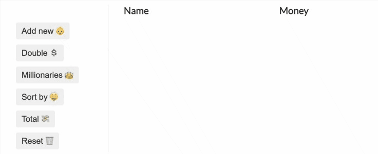

# Random money rank 

This react project is mainly for practicing higher order functions.

Random names are fetched from [randomuser.me](https://randomuser.me). Random money is given to the names. With higher order functions, people can double the money, filter the millionaries, sort by the richest, get total amount.

## Lessons Learned

- map, filter, sort, reduce
- new Intl.NumberFormat
- axios

## Demo



## Run Locally

Install

```bash
  yarn
```
Start app 
```bash
  yarn start
```


